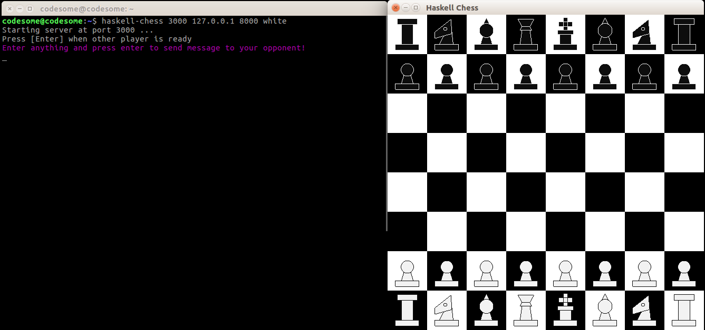
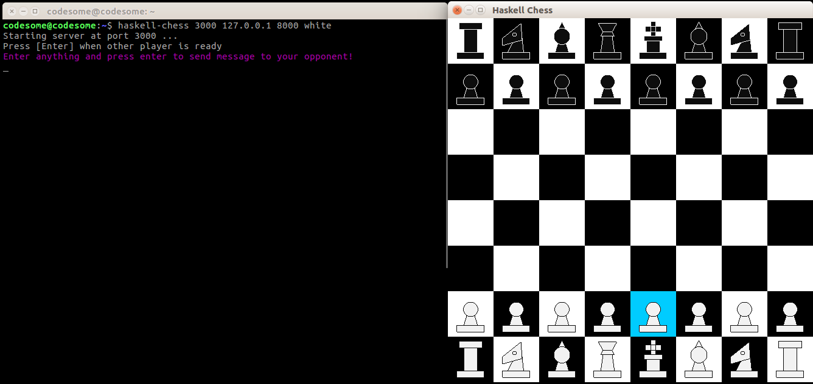
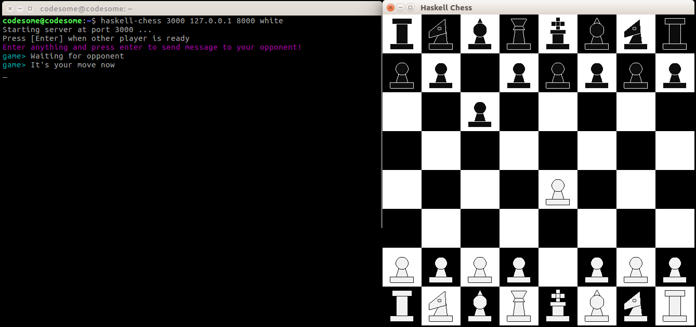
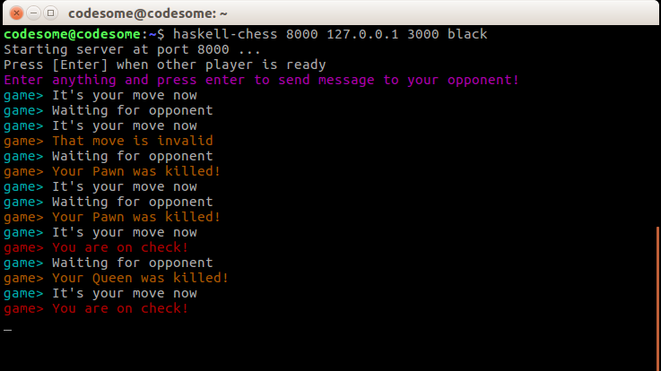

# Instructions

Start off the game by following the steps given [here](https://github.com/thecodesome/Haskell-Chess)

### How to move

Left click on the piece that you want to move

Right click on the destination

You will be notified about the moves in the console.

